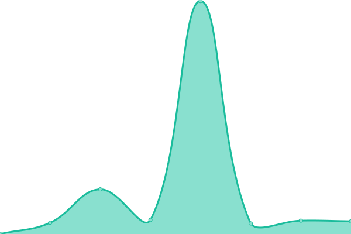
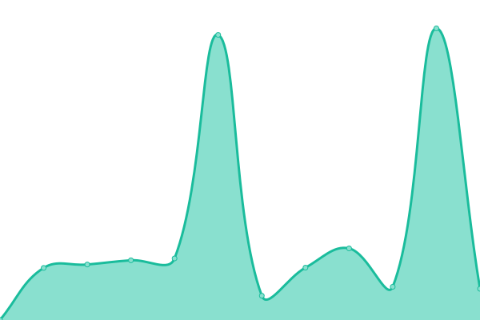

# [📈 Live Status](https://dump-hr.github.io/uptime): <!--live status--> **🟩 All systems operational**

This repository contains the open-source uptime monitor and status page for [DUMP Association of young programmers](http://dump.hr/), powered by [Upptime](https://github.com/upptime/upptime).

With [Upptime](https://upptime.js.org), you can get your own unlimited and free uptime monitor and status page, powered entirely by a GitHub repository. We use [Issues](https://github.com/dump-hr/uptime/issues) as incident reports, [Actions](https://github.com/dump-hr/uptime/actions) as uptime monitors, and [Pages](https://dump-hr.github.io/uptime) for the status page.

<!--start: status pages-->
<!-- This summary is generated by Upptime (https://github.com/upptime/upptime) -->
<!-- Do not edit this manually, your changes will be overwritten -->
<!-- prettier-ignore -->
| URL | Status | History | Response Time | Uptime |
| --- | ------ | ------- | ------------- | ------ |
|  [dump.hr](https://dump.hr/) | 🟩 Up | [dump-hr.yml](https://github.com/dump-hr/uptime/commits/HEAD/history/dump-hr.yml) | 

 740ms
     
 | 

<a href="https://dump-hr.github.io/uptime/history/dump-hr">100.00%</a>
    

|  [days.dump.hr](https://days.dump.hr/) | 🟩 Up | [days-dump-hr.yml](https://github.com/dump-hr/uptime/commits/HEAD/history/days-dump-hr.yml) | 

 1672ms
     
 | 

<a href="https://dump-hr.github.io/uptime/history/days-dump-hr">100.00%</a>
    

|  [2021.days.dump.hr](https://2021.days.dump.hr/) | 🟩 Up | [2021-days-dump-hr.yml](https://github.com/dump-hr/uptime/commits/HEAD/history/2021-days-dump-hr.yml) | 

 530ms
     
 | 

<a href="https://dump-hr.github.io/uptime/history/2021-days-dump-hr">100.00%</a>
    

|  [2019.days.dump.hr](https://2019.days.dump.hr/) | 🟩 Up | [2019-days-dump-hr.yml](https://github.com/dump-hr/uptime/commits/HEAD/history/2019-days-dump-hr.yml) | 

 388ms
     
 | 

<a href="https://dump-hr.github.io/uptime/history/2019-days-dump-hr">100.00%</a>
    

|  [2018.days.dump.hr](https://2018.days.dump.hr/) | 🟩 Up | [2018-days-dump-hr.yml](https://github.com/dump-hr/uptime/commits/HEAD/history/2018-days-dump-hr.yml) | 

 560ms
     
 | 

<a href="https://dump-hr.github.io/uptime/history/2018-days-dump-hr">100.00%</a>
    

|  [2017.days.dump.hr](https://2017.days.dump.hr/) | 🟩 Up | [2017-days-dump-hr.yml](https://github.com/dump-hr/uptime/commits/HEAD/history/2017-days-dump-hr.yml) | 

 257ms
     
 | 

<a href="https://dump-hr.github.io/uptime/history/2017-days-dump-hr">100.00%</a>
    

|  [day.dump.hr](https://day.dump.hr/) | 🟩 Up | [day-dump-hr.yml](https://github.com/dump-hr/uptime/commits/HEAD/history/day-dump-hr.yml) | 

 1004ms
     
 | 

<a href="https://dump-hr.github.io/uptime/history/day-dump-hr">100.00%</a>
    

|  [turnir.dump.hr](https://turnir.dump.hr) | 🟩 Up | [turnir-dump-hr.yml](https://github.com/dump-hr/uptime/commits/HEAD/history/turnir-dump-hr.yml) | 

 424ms
     
 | 

<a href="https://dump-hr.github.io/uptime/history/turnir-dump-hr">100.00%</a>
    

<!--end: status pages-->

[**Visit our status website →**](https://dump-hr.github.io/uptime)

## 📄 License

- Powered by: [Upptime](https://github.com/upptime/upptime)
- Code: [MIT](./LICENSE) © [DUMP Association of young programmers](http://dump.hr/)
- Data in the `./history` directory: [Open Database License](https://opendatacommons.org/licenses/odbl/1-0/)
